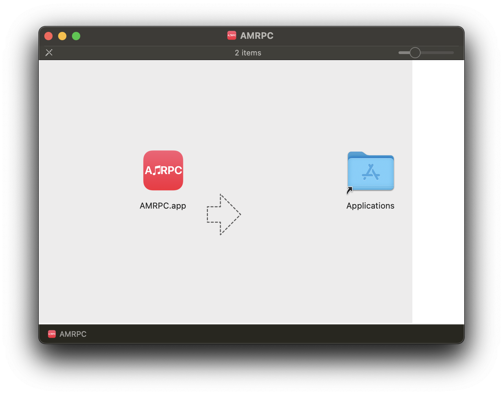

# macOS

_Important: Since we don't have an Apple developer license (which costs $99/year), you will need to manually grant AMRPC access._ [_Learn more_](https://support.apple.com/en-us/HT202491)

1. Download the [latest release](https://github.com/ZephraCloud/Apple-Music-RPC/releases/latest)
2. Open **AMRPC-Installer-macOS.dmg**
3. You should now see this:

4\. Click and hold the Apple Music logo and move it to the **Applications** folder

5\. Close the window

6\. **Done!**

### Requirements

* macOS 10.11 (El Capitan) or later

### Do I need arm64 or x64

Open **About This Mac**. If you see Apple M1 (or higher) in the "Chip" (or "Processor") section, you need to download arm64. If not, then x64.
